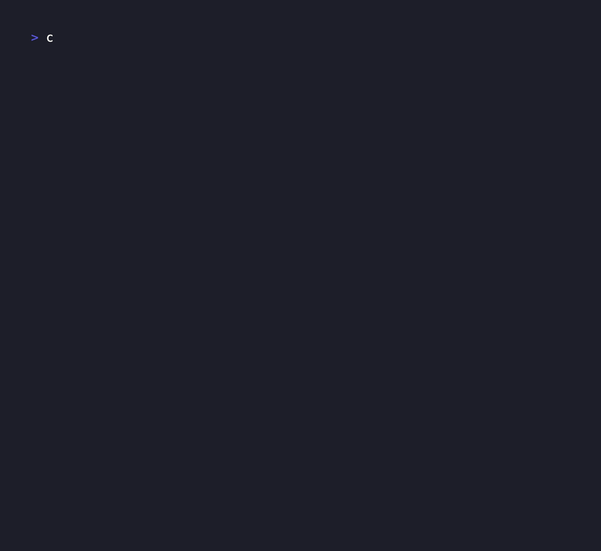

*⚠️  This project is still experimental. Features may change without notice. Use with caution! ⚠️*

# cal2prompt

cal2prompt is a command-line tool that fetches your schedule (e.g., from Google Calendar) and converts it into a custom prompt or text snippet via a template engine. It can output directly to your stdout, or run as an experimental MCP (Model Context Protocol) server.

cal2prompt uses the [Google Calendar API version 3](https://developers.google.com/calendar/api/v3/reference?hl=ja).

*CLI Example*


*Model Context Protocol(MCP) Example(experimental)*


## Features

- 🚀 **Google Calendar Integration**  
  Utilizes the [Google Calendar API v3](https://developers.google.com/calendar/api/v3/reference?hl=ja) to fetch your schedule.

- 📄 **Flexible LLM Prompt Customization with a Template Engine**  
  Customize the generated prompts using the [Jinja2](https://jinja.palletsprojects.com/en/stable/) template engine.

- ⚡️ **Blazing fast**  
  High-speed Processing Powered by the Rust Ecosystem.

- 🔧 **Experimental MCP Mode**  
  Run cal2prompt as a [Model Context Protocol](https://modelcontextprotocol.io/introduction) server.  


## Installation

### Brew (MacOS)

```bash
brew install shuntaka9576/tap/cal2prompt
```

### Cargo (git)
```bash
git clone https://github.com/shuntaka9576/cal2prompt
cd cal2prompt
cargo install --path .
```

## Usage

```bash
$ cal2prompt --help
✨ Fetches your schedule (e.g., from Google Calendar) and converts it into a single LLM prompt. It can also run as an MCP (Model Context Protocol) server.

Usage: cal2prompt [OPTIONS] [COMMAND]

Commands:
  mcp   Launch cal2prompt as an MCP server (experimental).
  help  Print this message or the help of the given subcommand(s)

Options:
      --since <DATE>  Start date (YYYY-MM-DD). Requires --until.
      --until <DATE>  End date (YYYY-MM-DD). Requires --since.
      --today         Fetch events for today only.
      --this-week     Fetch events for the current week (Mon-Sun).
      --this-month    Fetch events for the current month (1st - end).
      --next-week     Fetch events for the upcoming week (Mon-Sun).
  -h, --help          Print help
  -V, --version       Print version
```

### Initial setup

#### 1. Setup Google OAuth2.0 Client

We use OAuth2 for authenticating with your Google account. After authentication, the generated token is stored in the `oauth` file located in your platform’s data directory (e.g., `~/.local/share/cal2prompt/oauth` on Linux). When you launch cal2prompt for the first time, the authentication process will begin automatically—simply follow the on-screen instructions.

Currently, you must use your own Calendar API token. The Calendar API token is only granted to a limited number of users and requires Google’s approval. Even if I, as the project owner, were to provide a Google-approved client, there would inevitably be security risks. Therefore, you need to create and manage your own token.

Please follow the steps in [docs/setup-oauth](docs/setup-oauth.md) to create your own Google “project” and obtain an OAuth token.


#### 2. Setup configuration

Configuration is written in Lua. Below is an example of the configuration. You can separate public and private information into separate files if you prefer—simply customize it to suit your needs.

Create `~/.config/cal2prompt/secrets.lua` and add the following contents. The file name can be any name as long as it matches the require statement in the config.lua mentioned later.

Please specify the clientID, clientSecret, and Calendar ID you created earlier. You can find the Calendar ID in the Google Calendar web UI.

```lua
local M = {}

M.google = {
  clientID = "***.apps.googleusercontent.com",
  clientSecret = "***",
  calendarIDs = {
    "example@gmail.com"
  },
}

return M
```

Create `~/.config/cal2prompt/config.lua` and add the following contents:

```lua
local cal2prompt = require("cal2prompt") -- builtin module
local os = require("os") -- stdlib
local secrets = require("secrets")

return {
  settings = {
    -- see https://en.wikipedia.org/wiki/List_of_tz_database_time_zones
    -- TZ = "Etc/UTC",
    TZ = "Asia/Tokyo",
    -- TZ = "America/Los_Angeles"
    -- TZ - "Asia/Shanghai"
  },
  source = {
    google = {
      oauth2 = {
        clientID = secrets.google.clientID,
        clientSecret = secrets.google.clientSecret,
      },
      calendar = {
        getEvents = {
          calendarIDs = secrets.google.calendarIDs,
        },
      },
    },
  },
  output = {
    -- template = cal2prompt.template.google.standard
    template = [[
Here is your schedule summary. Please find the details below:

## Date: {{ day.date }}
--------------------------------------

### All-Day Events:

  (No all-day events)

  
  - {{ ev.summary }}
    - (All Day)
    - Location: {{ ev.location or "N/A" }}
    - Description: {{ ev.description or "No description." }}
    - Attendees:
      
        
        - {{ a }}
        
      
      - (No attendees)
      
  


### Timed Events:

  (No timed events)

  
  - {{ ev.summary }}
    - Start: {{ ev.start }}
    - End:   {{ ev.end }}
    - Location: {{ ev.location or "N/A" }}
    - Description: {{ ev.description or "No description." }}
    - Attendees:
      
        
        - {{ a }}
        
      
      - (No attendees)
      
  


]],
  },
}
```

#### 3. CLI Authentication

cal2prompt executes the OAuth 2.0 flow to obtain authentication credentials. For detailed step-by-step flow instructions, please refer to [docs/setup-cli-auth](docs/setup-cli-auth.md)

```bash
cal2prompt
```

### Integrating Claude Desktop with MCP

Please add the following configuration to `~/Library/Application\ Support/Claude/claude_desktop_config.json`:

- For `mcpServers.cal2prompt.command`: You must specify the full path obtained by running `which cal2prompt`.
- For `mcpServers.cal2prompt.env.HOME`: Since Claude Desktop may not inherit the HOME environment variable, so it needs to be set explicitly.

```json
{
  "mcpServers": {
    "cal2prompt": {
      "command": "/Users/username/.cargo/bin/cal2prompt",
      "args": ["mcp"],
      "env": {
        "HOME": "/Users/username"
      }
    }
  }
}
```

## Configuration

### Config Options

|Variable Name|Required|Description|Default Value|
|---|---|---|---|
|`settings.TZ`|true| [IANA](https://en.wikipedia.org/wiki/List_of_tz_database_time_zones) time zone format. (e.g. `America/Los_Angeles` `Asia/Tokyo`) |`UTC`|
|`settings.oauthFilePath`|false|Path where OAuth2.0 tokens are temporarily stored. Typically, users do not need to change this unless they have a custom setup.|`~/.local/share/cal2prompt/oauth`|
|`source.google.oauth2.clientID`|true|Your Google OAuth2 Client ID used for authenticating with the Google Calendar API.|*(No default; must be specified)*|
|`source.google.oauth2.clientSecret`|true|Your Google OAuth2 Client Secret used for authenticating with the Google Calendar API.|*(No default; must be specified)*|
|`source.google.oauth2.scopes`|false|Scopes to grant to Google OAuth 2.0 client. Please refer to [here](https://developers.google.com/calendar/api/auth) for the types of scopes.|[`https://www.googleapis.com/auth/calendar.events`]|
|`source.google.oauth2.redirectURL`|false|The OAuth2 callback URL to which Google will send responses.|`"http://127.0.0.1:9004"`|
|`source.google.calendar.getEvents.calendarIDs`|true|A list of one or more Google Calendar IDs from which cal2prompt will fetch events. Each ID can typically be found in your Google Calendar settings. If multiple IDs are provided, events from each calendar will be fetched and combined in chronological order.|*(No default; must be specified)*|
|`output.template`|true|A string that defines how the fetched calendar data should be formatted/output.|*(No default; must be specified)*|
|`experimental.mcp.insertCalendarEvent.calendarID`|false|The ID of the Google Calendar to which new events will be inserted when using the experimental MCP feature.|None

## Environment

|Variable Name|Description|Default Value|
|---|---|---|
|`CAL2_PROMPT_CONFIG_FILE_PATH`|Path to a custom Lua configuration file if you do not want to use the default. |`~/.config/cal2prompt/config.lua`|
