## Setup Google OAuth Client

### 1. [Create a New Project](https://console.developers.google.com/projectcreate) within the Google developer console.
If a project already exists, please skip these steps.

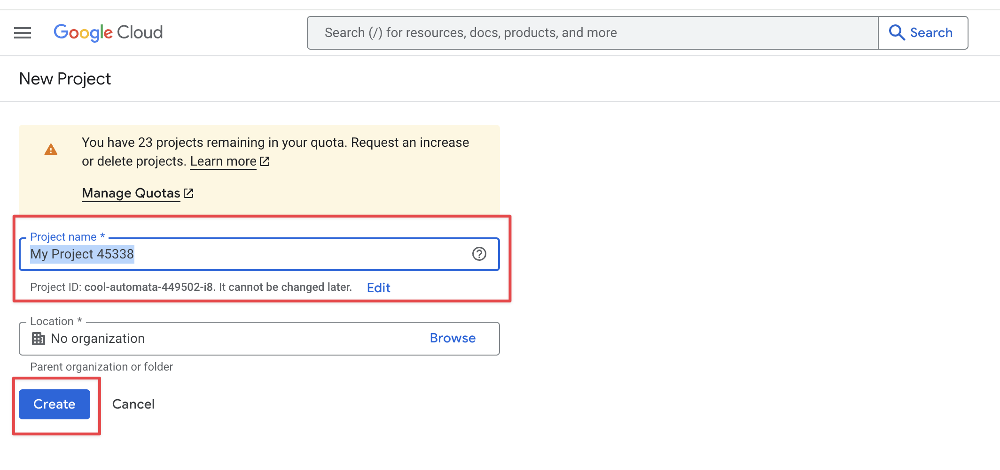

### 2. [Enable Google Calendar API](https://console.developers.google.com/apis/api/calendar-json.googleapis.com/)
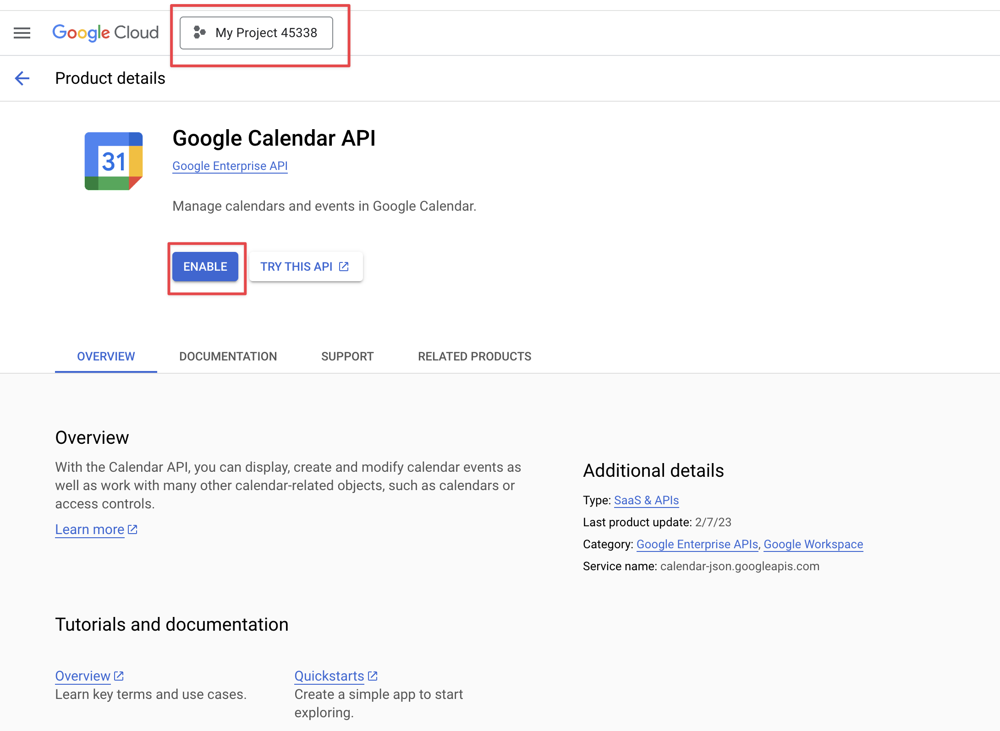

### 3. [Create OAuth2 consent screen](https://console.developers.google.com/apis/credentials/consent/edit;newAppInternalUser=false) 

3.1. Specify App name and User support email.
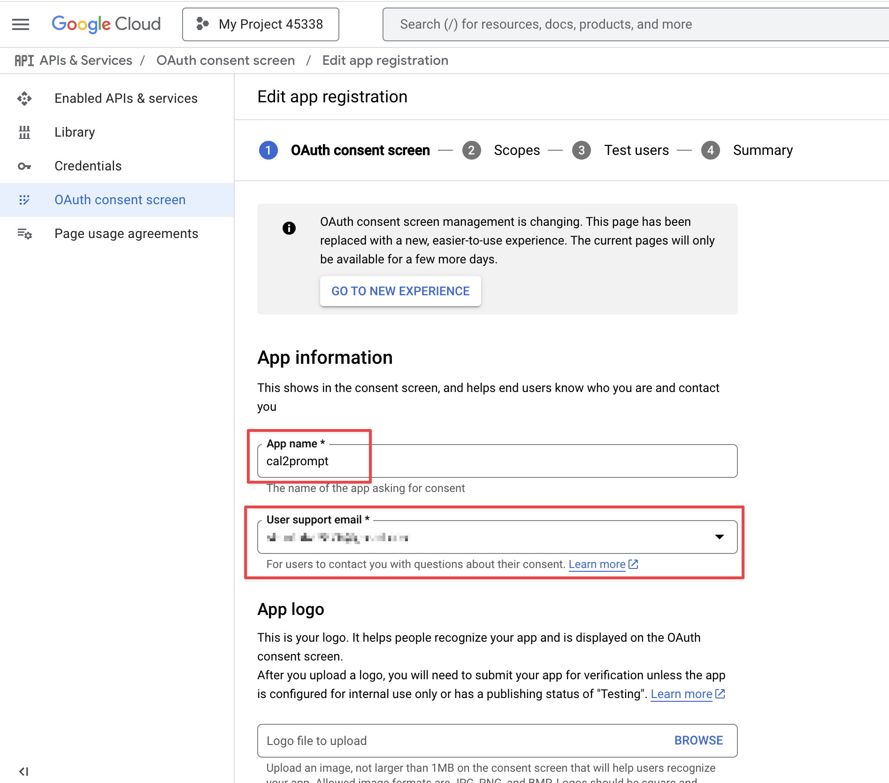

3.2. Specify Developer contact information.
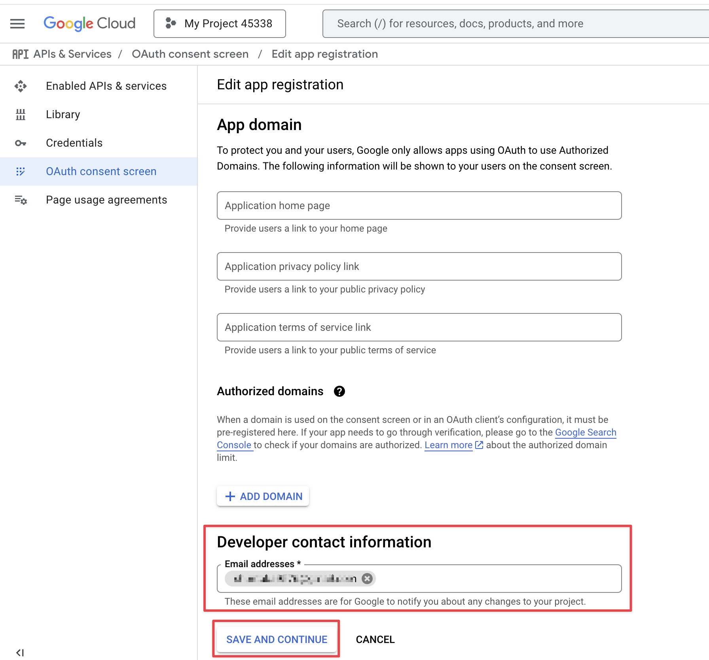

3.3. Save scope settings.
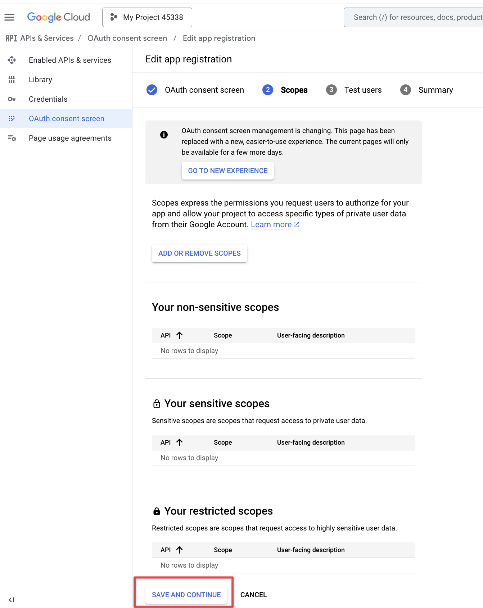

3.4. Add test users.Set up the email address for the calendar you want to view in the cal2prompt.
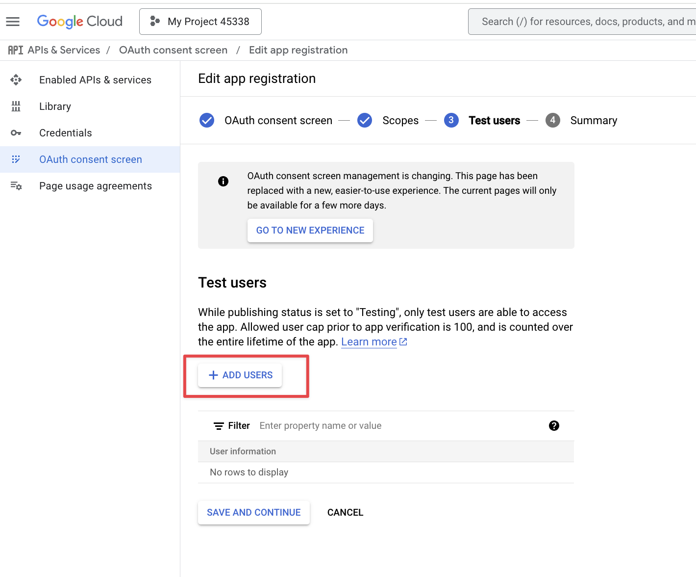
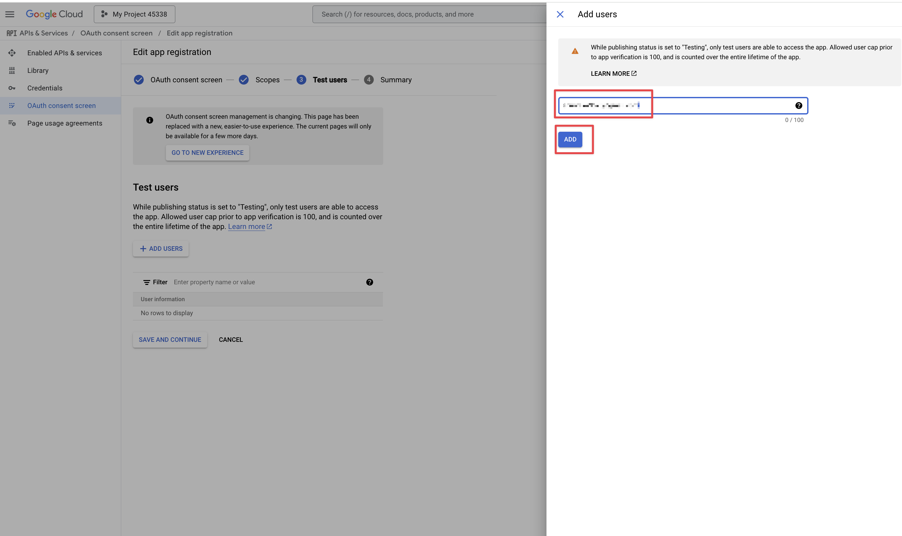
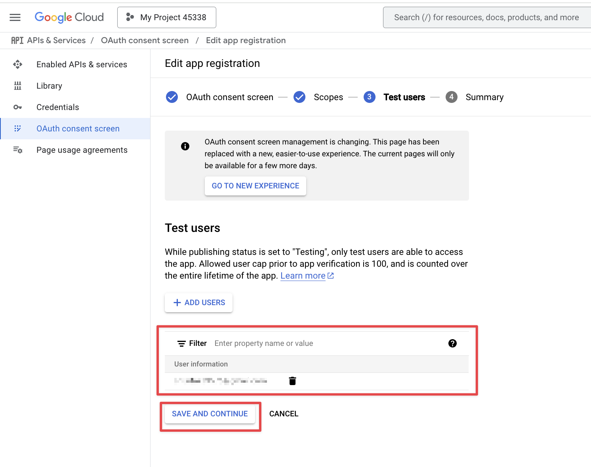

3.5. Review your settings and return to the dashboard.
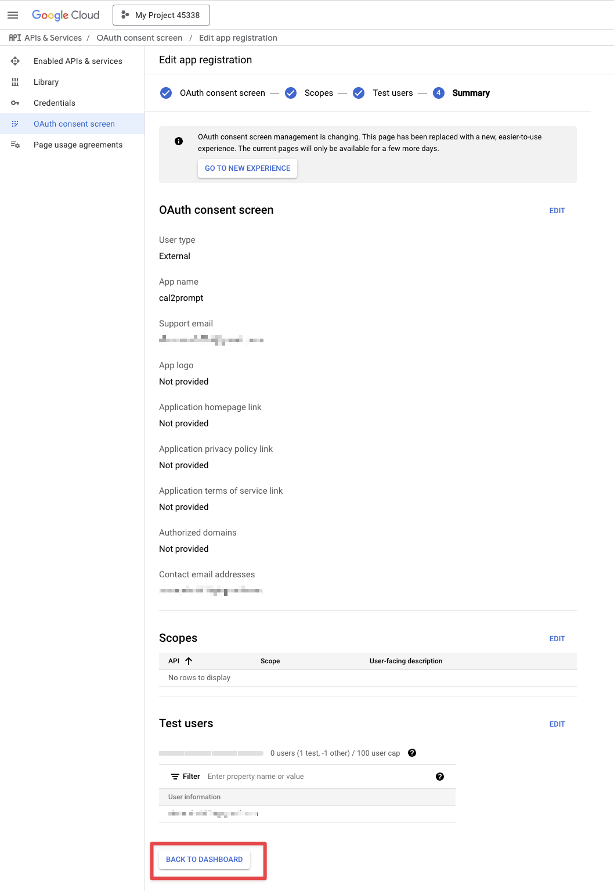

### 4. [Create OAuth Client](https://console.developers.google.com/apis/credentials/oauthclient)
4.1. For Application type, select 'Desktop app' and for Name, specify any value you prefer (for example, 'cal2prompt').
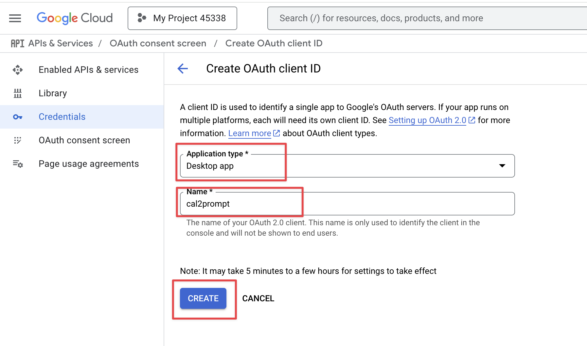

4.2. This completes the procedure for issuing the Client ID and Client secret 🎉."
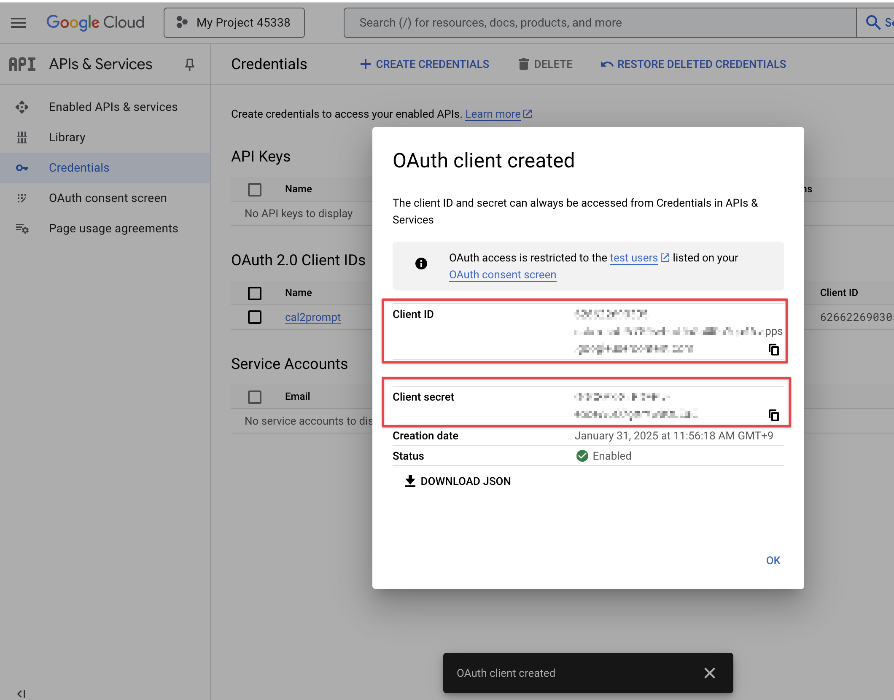

